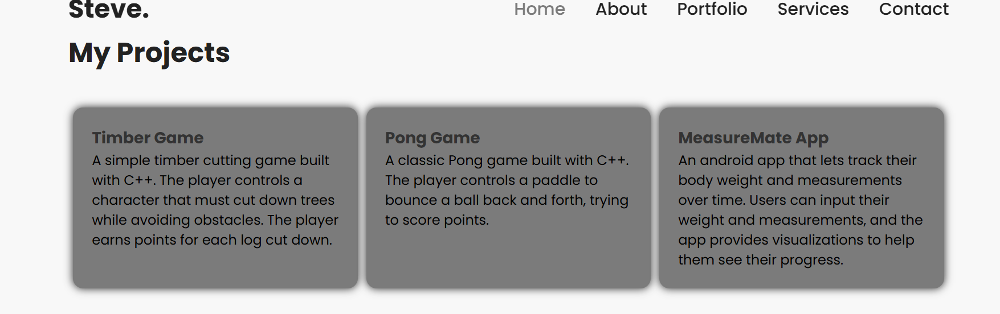
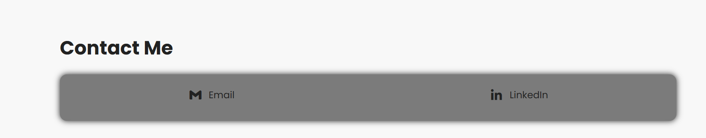

# 💼 Steve Omusula – Portfolio Website

Welcome to my personal portfolio! This website showcases my skills, experience, and projects as a passionate Computer Scientist and Developer.

## 🌐 Live Demo

You can view the live version of this portfolio here:  
🔗 [View Portfolio Website](https://plp-portfolio-inky.vercel.app/)

---

## 📁 Folder Structure

The project is structured as follows:

```
📦.
├── 📁public
│   ├── 📁assets
│   │   └── 📄 Stephen Omusula Resume.pdf
│   │   └── 🖼️ me_suit.png
│   ├── 📁styles
│   │   └── 🎨styles.css
│   └── 📝index.html
├── 📁screenshots
│   ├── 🖼️ home.PNG
│   ├── 🖼️ portfolio.PNG
│   └── 🖼️ contact.PNG
├── 📄 README.md
```

---

## 🔍 Features

- **Responsive Navigation Bar**  
  Smoothly scrolls to sections like About, Portfolio, Services, and Contact.

- **Animated Introduction**  
  Rotating job titles using CSS animations.

- **About & Education Section**  
  Introduces who I am and where I studied.

- **Programming Skills**  
  Displays programming languages I've worked with using Boxicons.

- **Project Portfolio**  
  Showcases C++ and Android projects, presented in cards.

- **Contact Section**  
  Quick links to email and LinkedIn, styled as interactive cards.

---

## 🧰 Technologies Used

- HTML5
- CSS3
- [Boxicons](https://boxicons.com/) (for icons)
- Custom Fonts & Responsive Layout

---

## 📷 Screenshots

| Section   | Preview                                              |
| --------- | ---------------------------------------------------- |
| Home      | __       |
| Portfolio | __ |
| Contact   | __     |

---

## 📝 How to Use

1. Clone the repository:
   ```bash
   git clone https://github.com/Steve-omush/PLP_Portfolio.git
   ```

---

## 📫 Contact Me

You can reach out to me at .

📧 **Email**: [stephenomusula3@gmail.com](mailto:stephenomusula3@gmail.com)  
🔗 **LinkedIn**: [linkedin.com/in/omusula](https://www.linkedin.com/in/omusula/)  
🐙 **GitHub**: [github.com/Steve-omush](https://github.com/Steve-omush)
